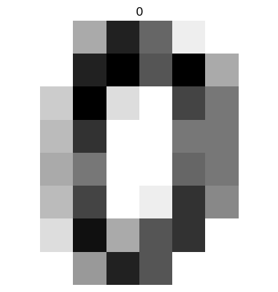

# scikit-learn
Handwritten digit recognition with scikit-learn
* We trained a simple neural network to recognize the numbers in these images. This network will take 1D arrays of 8x8=64 values as input. We then converted these 2D images into 1D arrays

<hr>

### We start by loading the sample
```python
from sklearn import datasets
digits = datasets.load_digits()
```
### Then we print the first image
```python
print(digits.images[0])
```
```terminal
[[ 0.  0.  5. 13.  9.  1.  0.  0.]
 [ 0.  0. 13. 15. 10. 15.  5.  0.]
 [ 0.  3. 15.  2.  0. 11.  8.  0.]
 [ 0.  4. 12.  0.  0.  8.  8.  0.]
 [ 0.  5.  8.  0.  0.  9.  8.  0.]
 [ 0.  4. 11.  0.  1. 12.  7.  0.]
 [ 0.  2. 14.  5. 10. 12.  0.  0.]
 [ 0.  0.  6. 13. 10.  0.  0.  0.]]
 ```
 ### Like all the images in the sample, this one is an 8x8 pixel image, black and white (a single color level per pixel). It can be displayed in the following way, also indicating the corresponding label (the number to which the image corresponds)
 ```python
 import matplotlib.pyplot as plt
plt.imshow(digits.images[0],cmap='binary')
plt.title(digits.target[0])
plt.axis('off')
plt.show()
```


### We will train a simple neural network to recognize numbers in these images. This network will take 1D arrays of 8x8=64 values as input. So we need to convert our 2D images into 1D arrays
```python
x = digits.images.reshape((len(digits.images), -1))
```
### x contient toutes les images en version 1D
```python
print(x[0])
```
```terminal
[ 0.  0.  5. 13.  9.  1.  0.  0.  0.  0. 13. 15. 10. 15.  5.  0.  0.  3.
 15.  2.  0. 11.  8.  0.  0.  4. 12.  0.  0.  8.  8.  0.  0.  5.  8.  0.
  0.  9.  8.  0.  0.  4. 11.  0.  1. 12.  7.  0.  0.  2. 14.  5. 10. 12.
  0.  0.  0.  0.  6. 13. 10.  0.  0.  0.]
```
### The network will act as a function allowing you to go from an array of 64 input values to an output value, its estimate of the figure. Here are the output values
```python
y = digits.target
print(len(digits.images))
```
```terminal
1797
```
### We will create a relatively simple neural network, with a single layer of 15 neurons.
```python
from sklearn.neural_network import MLPClassifier

mlp = MLPClassifier(hidden_layer_sizes=(15,))
```
### We will train this network on the first 1000 images of our sample, and reserve the following images to test the performance of the network
```python
x_train = x[:1000]
y_train = y[:1000]
x_test = x[1000:]
y_test = y[1000:]
```
```python
mlp.fit(x_train, y_train)
```
```output
/home/samglish/.local/lib/python3.9/site-packages/sklearn/neural_network/_multilayer_perceptron.py:691: ConvergenceWarning: Stochastic Optimizer: Maximum iterations (200) reached and the optimization hasn't converged yet.
```
